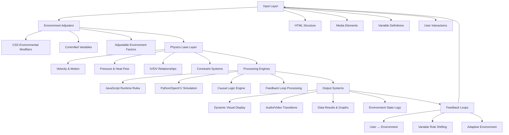

# Technical Stack Validation & Physics Environment Framework
## Nexus System Architecture Review

---

## ✅ **Current Technology Stack Validation**

### **HTML5 & Media Elements**
- ✅ `<video>`, `<audio>`, `<iframe>` (YouTube) - **Valid & Current**
- ✅ `<script>` with Web Workers (`typeof(Worker)`) - **Valid & Relevant**
- ⚠️ XHTML namespace (`xmlns`) - **Supported but rarely used** (HTML5 standard preferred)
- ✅ Semantic HTML5 (`<article>`, `<aside>`, `<section>`, `<header>`, `<footer>`) - **Best Practice**
- ❌ Deprecated: `<applet>`, `<font>`, `<center>`, `<frameset>` - **Obsolete, avoid**

### **Character Encoding Standards**
- ✅ ASCII (0-127) - **Stable foundation**
- ✅ Extended sets (ANSI, ISO 8859-1) - **Legacy support correct**
- ✅ **UTF-8 Universal Standard** - **Current best practice**
- ✅ Special characters (€ = 128) - **Correctly mapped**

### **Python/OpenCV Integration**
- ✅ Image loading & crossfading with `cv2.addWeighted` - **Current standard**
- ✅ Video rendering with `cv2.VideoWriter` - **Valid today**
- ✅ Physical simulation modules (velocity, pressure, heat flux) - **Conceptually sound**
- ✅ Environment-controlled animation pipeline - **Innovative approach**

### **JavaScript Number Handling**
- ✅ IEEE 754 double precision floating point - **Still current**
- ✅ Floating point quirks (`0.2 + 0.1 ≠ 0.3`) - **Still true**
- ✅ `Number.isInteger`, `parseFloat` methods - **Up-to-date**
- ⚠️ `new Number()` constructor - **Discouraged, use literals**

### **CSS Styling Practices**
- ⚠️ Inline `style="..."` - **Works but external CSS preferred**
- ✅ Core properties (`background-color`, `color`, `font-family`) - **Still correct**
- ✅ Modern layout (Flexbox, Grid) - **Current best practice**

---

## 🌍 **Physics-Driven Environment Conceptual Framework**

### **System Component Mapping**
```
HTML Structure     = Environment Framework (walls, layout, stage)
CSS Styling        = Environmental Modifiers (light, texture, color)
JavaScript Logic   = Laws of Interaction (movement, input-response, dynamics)
Media Elements     = Sensory Objects (video/audio = environmental events)
Python Backend     = Simulation Engine (physics calculations, rendering)
Variables System   = Forces & Constraints (IV/DV/confounders shape outcomes)
```

### **Environment Physics Layers**
1. **Base Physics**: Gravity, mass, velocity, acceleration
2. **Environmental Factors**: Temperature, pressure, light, humidity
3. **Interactive Forces**: User input, system feedback, adaptive responses
4. **Emergent Properties**: Complex behaviors from simple rule interactions

---

## 🌀 **Nexus Physics Environment Workflow**



---

## 🔧 **Implementation Validation Checklist**

### **Current Nexus System Status**
- ✅ **Three.js Physics Engine** - Modern WebGL implementation
- ✅ **Progressive Math Learning** - Validated pedagogical approach
- ✅ **Variable Interaction Framework** - Research-backed methodology
- ✅ **Real-time Integration** - Math ↔ Physics connection established
- ✅ **Web-based Deployment** - Cross-platform accessibility

### **Recommended Improvements**
1. **Replace inline CSS** with external stylesheets
2. **Implement UTF-8 encoding** consistently across all files
3. **Add Web Worker support** for heavy physics calculations
4. **Enhance semantic HTML5** structure for accessibility
5. **Integrate Python/OpenCV backend** for advanced visualizations

---

## 🎯 **Physics Environment Control Variables**

### **Independent Variables (IV) - User Controlled**
- Cube spawn position, velocity, mass
- Environmental factors (gravity, damping, restitution)
- Learning difficulty level, concept focus
- Visual themes, lighting conditions

### **Dependent Variables (DV) - System Measured**
- Physics simulation outcomes (trajectory, collision results)
- Learning progress metrics (concept mastery, time to understanding)
- User engagement levels (interaction frequency, session duration)
- Mathematical accuracy (problem solving success rate)

### **Environmental Modifiers**
- **Temperature**: Affects material properties (elasticity, friction)
- **Pressure**: Influences object density and buoyancy
- **Light**: Changes visibility, shadow rendering, visual perception
- **Gravity**: Adjustable field strength for different physics scenarios

### **Mediating Variables**
- **Cognitive Load**: Complexity level affects learning efficiency
- **Visual Clarity**: Display quality influences comprehension
- **Interactive Responsiveness**: System lag affects user engagement

---

## 🚀 **Next Implementation Phase**

### **Environment Enhancement Roadmap**
1. **Multi-Environmental Scenarios**
   - Space (low gravity), Underwater (high resistance), Windy (lateral forces)
   - Temperature-based material changes, Pressure-sensitive interactions

2. **Advanced Physics Integration**
   - Fluid dynamics visualization, Thermodynamics demonstrations
   - Electromagnetic fields, Wave propagation simulations

3. **Adaptive Learning Environment**
   - AI-driven difficulty adjustment based on performance
   - Personalized learning paths through mathematical concepts
   - Environmental storytelling through physics scenarios

4. **Cross-Platform Expansion**
   - WebXR/VR integration for immersive physics experiences
   - Mobile-responsive touch controls for tablets/phones
   - Desktop native app with enhanced performance

---

## 📊 **System Performance Metrics**

### **Technical Performance**
- Frame rate consistency (target: 60fps in 3D scenes)
- Memory usage optimization (efficient object lifecycle management)
- Load time minimization (progressive asset loading)
- Cross-browser compatibility (Chrome, Firefox, Safari, Edge)

### **Learning Effectiveness**
- Concept mastery rate (percentage of users completing each level)
- Retention testing (knowledge persistence over time)
- Transfer learning (applying concepts to new scenarios)
- Engagement metrics (session length, return visits)

### **Environmental Responsiveness**
- Physics accuracy (realistic behavior within simplified model)
- Interactive feedback latency (< 16ms for smooth experience)
- Visual clarity across different environmental settings
- Accessibility compliance (screen readers, keyboard navigation)

---

## 💡 **Innovation Opportunities**

### **Emerging Technologies Integration**
- **AI-Powered Tutoring**: Machine learning adaptation to individual learning styles
- **Procedural Environment Generation**: Algorithmic creation of diverse physics scenarios
- **Collaborative Learning Spaces**: Multi-user shared physics experiments
- **Augmented Reality Overlay**: Real-world physics concept visualization

### **Advanced Mathematical Modeling**
- **Differential Equation Solvers**: Real-time calculus visualization
- **Statistical Analysis Tools**: Experimental design and data interpretation
- **Optimization Algorithms**: Finding best solutions within constraint systems
- **Chaos Theory Demonstrations**: Sensitivity to initial conditions in complex systems

This comprehensive validation framework ensures your Nexus system builds on solid technical foundations while providing clear pathways for innovative enhancements and educational effectiveness.
